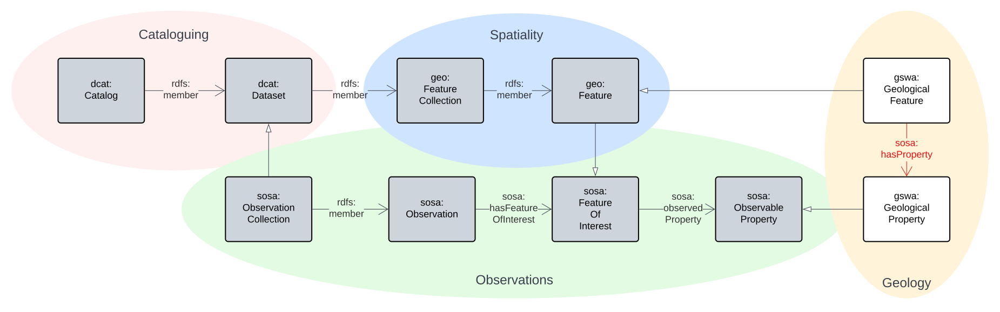

# Backbone Model

## Intro

<a href="assets/backbone-overview.svg">
<figure id="figure-bh" markdown>
  
  <figcaption>Figure BO: Overview of the main classes and relations in the Backbone Model</figcaption>
</figure>
</a>

The _Backbone Model_ of this Supermodel is the core model that all _Component Model_ instances must conform to. This means that all data in all _Component Model_ instances must pass the _Backbone Model_ validator.

This model is mostly just a _profile_ of particular _Background Models_, that is, it doesn't introduce much novel modelling but instead mainly selects elements from existing models and mandates particular patterns of use, such as requiring certain properties to be present. 

For example, this Model profiles [GeoSPARQL](background.md#geosparql), a well-known model used to model spatial objects, and indicates that instances of GeoSPARQL's `Feature` class are modelled to be collected in `FeatureCollection` classes.

This model only introduces two novel classes at the highest level:

* `Geological Feature`
    * A geospatial `Feature` that is defined by its geological properties
* `Geological Property`
    *  An observable quality (property, characteristic) of a Geological `Feature`

Specialised parts of the total modelling regime within this Supermodel are handled by _Component Models_, not this Backbone Model. For example, specialised types of man-made `Feature` are defined in the [Sites & Admin Features](components/sites-admin.md) component model.

### Examples

An example of dummy data that is valid according to this BackBone Model's validator:

```
# this is a Geological Feature
<http://example.com/gf/0001>
    a gswa:GeologicalFeature ;
.

# the Feature above is part of a Collection
<http://example.com/col/ABC>
    rdfs:member <http://example.com/gf/0001>
.

# the Collection above is part of a Dataset
# which is themed as being about Geochronology
<http://example.com/dataset/X>
    rdfs:member <http://example.com/col/ABC> ; 
    # Geochronology
    dcat:theme <https://linked.data.gov.au/def/anzsrc-for/2020/370502> ;
.
```

An example of invalid dummy data:

```
# this is a Geological Feature
<http://example.com/gf/0001>
    a gswa:GeologicalFeature ;
.

# the Feature is indicated as being a member of a Dataset
# but no Feature Collection instances are given
<http://example.com/dataset/X>
    rdfs:member <http://example.com/gf/0001> ;
.
```

## Profile Definition

This model is formally defined as a profile of a number of standards in the profile definition:

* [Backbone Model Profile Declaration](https://github.com/nicholascar/gswa-supermodel/blob/main/rdf/backbone/profile.ttl)

This can be summarised like this: 

1. The _Backbone Model_ is a profile of [SOSA](background.md#sosa), [GeoSPARQL](background.md#geosparql), [AnzGeoDCAT](background.md#anzgeodcat) & [VocPub](background.md#vocpub) and, through them, [DCAT](background.md#dcat), [SKOS](background.md#skos). All of these are, in turn, profiles of [OWL](background.md#owl)
    1. see the figure below
2. It contains multiple profile resources:
    1. see the table below

This model's profile hierarchy is as follows:

<figure markdown>
    
  <figcaption>Figure BP: The Standards profiles by this Backbone Model.</figcaption>
</figure>

The profile resources and their roles are as follows:

**Resource** | **Role**
--- | ---
[Profile Declaration](https://github.com/nicholascar/gswa-supermodel/blob/main/rdf/backbone/profile.ttl) | profile definition
[Validator](https://github.com/nicholascar/gswa-supermodel/blob/main/rdf/backbone/validator.ttl) | [Validation](https://www.w3.org/TR/dx-prof/#Role:validation)
[Compounded Validator](https://github.com/nicholascar/gswa-supermodel/blob/main/rdf/backbone/validator-compounded.ttl) | [Validation](https://www.w3.org/TR/dx-prof/#Role:validation)
this documentation | [Specification](https://www.w3.org/TR/dx-prof/#Role:guidance) & [Guidance](https://www.w3.org/TR/dx-prof/#Role:guidance)


## Validator

* [Backbone Model validator](https://github.com/nicholascar/gswa-supermodel/blob/main/rdf/backbone/validator.ttl)

This validator only tests for specific rules encoded within this _Backbone Model_. 

To test data for full conformance to this _Backbone Model_ and all the things that this _Backbone Model_ profile, such as GeoSPARQL, VocPub etc., use the compounded validator:

* [Backbone Model compounded validator](https://github.com/nicholascar/gswa-supermodel/blob/main/rdf/backbone/validator-compounded.ttl)

This validator contains the Backbone Model validator and all dependent validators too.

## Requirements

This _Backbone Model_ ensures that the following requirements of data are met:

**ID** | **Title** | **Description**
--- | --- | --- 
R01 | Individually managed collection. of data must be modelled as [dcat:Dataset](https://www.w3.org/TR/vocab-dcat/#Class:Dataset) instances | Datasets are defined, described and registered in a catalogue
R02 | Datasets must have basic metadata | Datasets, modelled as [dcat:Dataset](https://www.w3.org/TR/vocab-dcat/#Class:Dataset) instances, must have the following properties recorded: [dcterms:title](https://www.w3.org/TR/vocab-dcat/#Property:resource_title), [dcterms:description](https://www.w3.org/TR/vocab-dcat/#Property:resource_description), [dcterms:created](http://purl.org/dc/terms/created) , [dcterms:modified](http://purl.org/dc/terms/modified), [dcat:contactPoint](https://www.w3.org/TR/vocab-dcat/#Property:resource_contact_point), [dcterms:publisher](https://www.w3.org/TR/vocab-dcat/#Property:resource_publisher) (this will usually be GSWA) 
R03 | |
... | | 
RXX | Geospatial objects must be modelled as [geo:Feature](https://opengeospatial.github.io/ogc-geosparql/geosparql11/spec.html#_class_geofeature) instances | Features have spatial projections as Geometries and may have spatial relations to other Features as well as non-spatial relations to other class instances