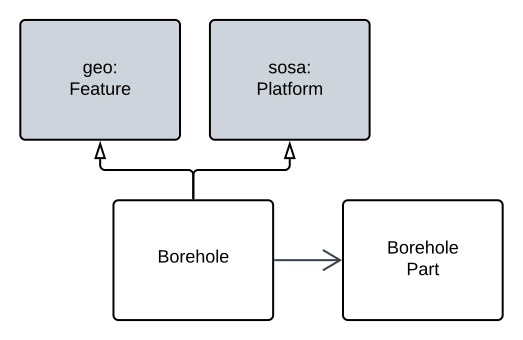

# WA Boreholes Profile

<!--
<div style="text-align:right;">
    <div style="float:right; text-align:left; width: 30%; border:solid 2px #10797E; padding:10px; margin-left:5px; background-color: rgb(240, 240, 240);">
        <p>Machine-readable RDF:</p>
        <ul>
            <li><a href="https://raw.githubusercontent.com/nicholascar/gswa-supermodel/main/rdf/wa-borehole.ttl">Profile Definition</a></li>
            <li><a href="">Schema</a></li>
        </ul>
    </div>
</div>
-->

This is a model that defines a `Borehole` class and a number of supporting classes and properties for it. 

## Resources

This Profile is made of many resources, all of which are contained in, or linked to from, this document. The resources and their roles are:

**Resource** | **Role**
--- | ---
Profile Definition | defines this set of resources - this table and text above
[Specification](#specification) | _[specification](https://www.w3.org/TR/dx-prof/#Role:specification)_<br />defines the profile elements in human-readable form
[Schema](#schema) | _[schema](https://www.w3.org/TR/dx-prof/#Role:schema)_<br />machine-readable version of the Specification's elements
[Validator](#validators) | _[validation](https://www.w3.org/TR/dx-prof/#Role:validation)_<br />machine-executable rules to test data for conformance to this Profile
[Compounded Validator](#validators) | _[validation](https://www.w3.org/TR/dx-prof/#Role:validation)_<br />this profile's validator & those of all dependencies in one
[Vocabularies](#vocabularies) | _[vocabulary](https://www.w3.org/TR/dx-prof/#Role:vocabulary)_<br />defines terms used in the profile specification
[Examples](#examples) | _[example](https://www.w3.org/TR/dx-prof/#Role:schema)_<br />valid and invalid data files
[Code Repository](#code-repository) | _[repository](https://www.w3.org/TR/dx-prof/#Role:schema)_<br />an online repository storing all of this Profile's resources

This is an interpretation of [GeoSciML](background.md#geosciml)'s non-Semantic Web Boreholes model in Semantic Web form, with alignments to [GeoSPARQL](background.md#geosparql) (for spatiality) and [SOSA](background.md#sensor-observation-sample-and-actuator-ontology-sosa) (for sampling features & systems) realised through this being a profile of the [FSDF Backbone Model](https://linked.data.gov.au/def/fsdf-backbone), since that profiles GeoSPARQL and SOSA.

This profile's dependencies, as stated above, are shown graphically, in the figure below.

<figure markdown>
  
  <figcaption>Figure BH: Profile hierarchy of the Boreholes Profile</figcaption>
</figure>

Given the 

In essence, a _Borehole_ is both a kind of spatial feature - something that is somewhere - and also a thing which takes samples of something else to characterise it - samples of a portion of the earth's crust. 

The figure below is an [OWL](background.md#web-ontology-language-owl) diagram of the major components within this profile, including the [Background Model](background.md) elements which they profile.

<figure markdown>
    
  <figcaption>Figure BO: Overview diagram of this Borehole Profile</figcaption>
</figure>

## Specification

### Classes

**Property** | **Value**
--- | ---
IRI | https://linked.data.gov.au/def/xxx/Borehole
Name | Borehole
Description | _Coming..._

### Properties

## Schema

## Validators

## Vocabularies

## Examples

```turtle
:x
    a gswa:Borehole ;
    rdfs:label "Borehole X" ;
    geo:hasGeometry [
        geo:asWKT "POINT (123, -45)
    ] ;
    
```

# Code Repository
