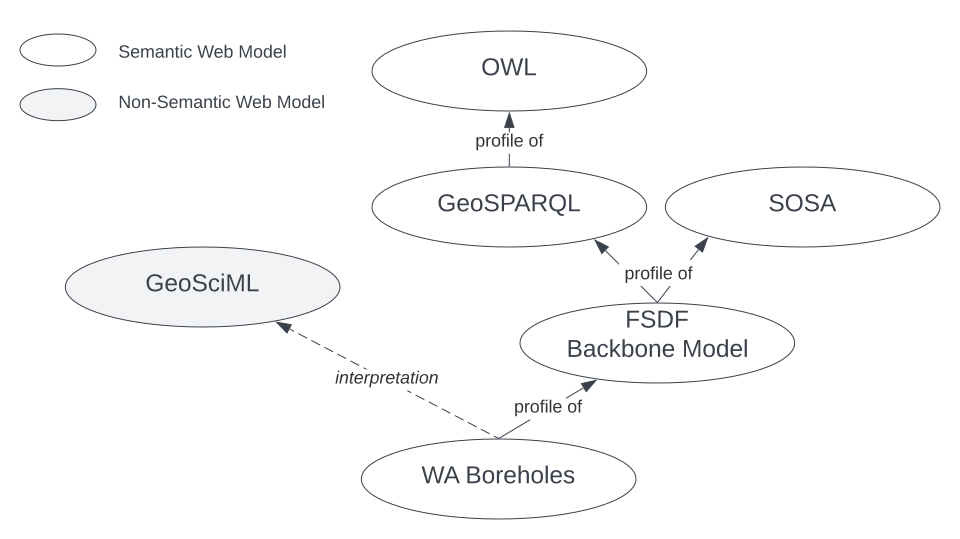
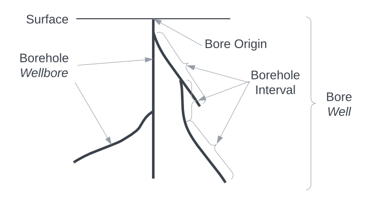

# Boreholes Profile

This [_Profile_](https://www.w3.org/TR/dx-prof/#dfn-profile) is a specification of a model, data validators, supporting vocabularies and other items for the description of **boreholes**, also known as well bores, that constrains other Standards.

The various parts of this Profile are listed in the [Profile Definition Section](#profile-definition) below.

The Semantic Web model component of this Profile, it's schema, is published online at a persistent web location:

* **<https://linked.data.gov.au/def/borehole>**

## Profile Definition

### Is Profile Of 

This Profile is a specialisation of - a constraining of - several existing Standards, some of which are about boreholes and some of which are about more fundamental concepts relevant to boreholes, such as spatiality and sampling. Specifically, this Profile is an interpretation of [GeoSciML](../background.md#geosciml)'s non-Semantic Web Boreholes model in Semantic Web form, with alignments to [GeoSPARQL](../background.md#geosparql) (for spatiality) and [SOSA](../background.md#sosa) (for sampling features & systems) realised through this being a profile of the [FSDF Backbone Model](https://linked.data.gov.au/def/fsdf-backbone), since that profiles GeoSPARQL and SOSA.

The things this Profile is a profile of - the things it constrains and is dependent on - as stated above, are shown graphically, in [Figure BH](#figure-bh) below.

<figure id="figure-bh" markdown>
  
  <figcaption>Figure BH: Profile hierarchy of the Boreholes Profile</figcaption>
</figure>

### Resources

This Profile is made of many resources, all of which are contained in, or linked to from, this document. The resources and their roles are:

**Resource** | **Role**
--- | ---
Profile Definition | defines this set of resources - this table and text above
[Specification](#specification) | _[specification](https://www.w3.org/TR/dx-prof/#Role:specification)_<br />defines the profile elements in human-readable form
[Schema](#schema) | _[schema](https://www.w3.org/TR/dx-prof/#Role:schema)_<br />machine-readable version of the Specification's elements<br /><br />This is the Semantic Web model within this profile, online at <https://linked.data.gov.au/def/borehole>
[Validator](#validators) | _[validation](https://www.w3.org/TR/dx-prof/#Role:validation)_<br />machine-executable rules to test data for conformance to this Profile
[Compounded Validator](#validators) | _[validation](https://www.w3.org/TR/dx-prof/#Role:validation)_<br />this profile's validator & those of all dependencies in one
[Vocabularies](#vocabularies) | _[vocabulary](https://www.w3.org/TR/dx-prof/#Role:vocabulary)_<br />defines terms used in the profile specification
[Examples](#examples) | _[example](https://www.w3.org/TR/dx-prof/#Role:schema)_<br />valid and invalid data files
[Code Repository](#code-repository) | _[repository](https://www.w3.org/TR/dx-prof/#Role:schema)_<br />an online repository storing all of this Profile's resources

## Specification

This Specification is the normative statement of requirements for data to conform to this Profile. This Specification is human-readable - this document - and does not provide either a formal model schema or data validators: those are provided for by the _schema_ and _validator_ resources listed in the [Resources Section](#resources) above and described below.

### Introduction

This profile is all about "boreholes", which are sometimes known by other names, such as "wells" or "drillholes". The concepts and relationships in this specification and in this Profile generally are not dependent on particular labels, and they may be used interchangeably, according to the equivalences given in the class definitions below in the [Classes Section](#classes): see the preferred and alternate labels for the classes.

[Figure BC](#figure-bc) shows some major physical elements of a borehole that this profile caters for, as well as some of the alternative names for them, in _italics_.

<figure id="figure-bc" markdown>
  
  <figcaption>Figure BC: Borehole Concepts. A Borehole (also known as a Well) consists of one or more Bores (Wellbores) into the earth. Geology of the earth may be characterised according to Borehole Intervals (Wellbore Intervals). The Borehole starts at a single origin point on the surface of the earth which may be on land or below the sea.</figcaption>
</figure>

This Specification defines data classes and properties that can be used to describe boreholes in line with the concepts of the Figure above. The classes and properties are defined in a following section after the total model which uses them is introduced next.

### Model

Knowledge Graph data models define data _classes_ with _properties_ and, sometimes _axioms_ which are logical rules that are applied to class and properties. This model, so far, only defines a few classes and properties for them, no axioms.

The Figure BO below is a classes and properties diagram (formally, an [OWL](../background.md#web-ontology-language-owl) diagram) of the major components of this profile's model. Where they match, the names of the classes in this Figure link them to the elements in the Concepts, [Figure BC](boreholes-profile.md) above.

> The Key for the elements in this Figure is the [figure key for this Supermodel](../supermodel.md#modelling-conventions).

<figure id="figure-bo" markdown>
    
  <figcaption>Figure BO: Overview of the model of this Borehole Profile. The Borehole class may be related to zero or more Bores which, in turn, may have zero or more Borehole Intervals. Borehole & Bores are geospatial Features and may have Geometries and Samples may be taken of Boreholes. Boreholes may be attributed to Agents (people and organisations) with the attribution qualified with Roles. A number of vocabulary-based classifiers are available for the Borehole, such as Borehole Purpose whose values are selected from controlled vocabularies supplied within this Profile.</figcaption>
</figure>

### Namespaces

Namespaces provide unique identity to elements within this Profile - classes, properties, validation shapes and example data. Prefixes for namespaces are used to assist with documentation readability.

Where you see a prefix used, something like `xxx:`, it is to be replaced with the namespace for complete term definition. For example, using the table below, we can understand that `bh:Borehole` is equivalent to `http://linked.data.gov.au/def/borehole/Borehole`.

The following prefixed namespaces are used in class and property definition tables and the code examples following:

**Prefix** | **Namespace** | **Description**
--- | --- | ---
`ex:` | `http://example.com/` | Generic, non-resolvable, examples
`bh:` | `http://linked.data.gov.au/def/borehole/` | This profile's schema/model
`bsp:` | `http://linked.data.gov.au/def/borehole-start-point/` | Borehole Start Point vocabulary, managed by the Geological Survey of Queensland
`dcat:` | `http://www.w3.org/ns/dcat#` | Data Catalogue vocabulary: cataloguing international standard
`dcterms` | `http://purl.org/dc/terms/` | Dublin Core Terms: basic library catalogue-style metadata
`geo:` | `http://www.opengis.net/ont/geosparql#` | GeoSPARQL: Semantic Web spatial international standard
`prov:` | `http://www.w3.org/ns/prov#` | Provenance Ontology: provenance data structures international standard
`rdfs:` | `http://www.w3.org/2000/01/rdf-schema#` | RDF Schema vocabulary: Basic structural RDF elements
`skos:` | `http://www.w3.org/2004/02/skos/core#` | Simple Knowledge Organization System: a model for controlled vocabularies

These namespaces appear at the start of RDF data files and SPARQL query files in a form similar to this table, for example in E.g. 01 [:octicons-link-external-16:](https://github.com/nicholascar/gswa-supermodel/blob/main/rdf/borehole/examples/eg-01.ttl), you can see the prefix `bh`for the Boreholes namespace on the first line: `PREFIX bh: <https://linked.data.gov.au/def/borehole/>`.

### Classes

#### Borehole
<a id="Borehole"></a>

**Property** | **Value**
--- | ---
IRI | [`bh:Borehole`](https://linked.data.gov.au/def/borehole/Borehole)
[Name](https://schema.org/name "sdo:name") | Borehole
[Alternate Name](https://schema.org/alternateName "sdo:alternateName") | Well, Drillhole
[Description](https://schema.org/description "sdo:description") | A borehole is a narrow shaft, or set of shafts, bored in the ground with a common point of origin. A borehole may be constructed for many different purposes, including the extraction of water, other liquids (such as petroleum) or gases (such as natural gas), as part of a geotechnical investigation, environmental site assessment, mineral exploration, temperature measurement, as a pilot hole for installing piers or underground utilities, for geothermal installations, or for underground storage of unwanted substances, e.g. in carbon capture and storage.
Expected Properties | [has origin position](#hasOriginPosition "bh:hasOriginPosition")<br />[has part](https://www.dublincore.org/specifications/dublin-core/dcmi-terms/#http://purl.org/dc/terms/hasPart "dcterms:hasPart") - for linking to [Bore](#Bore) objects)<br />[was attributed to](https://www.w3.org/TR/prov-o/#wasAttributedTo "prov:wasAttributedTo") - for linking to [Agent](https://www.w3.org/TR/prov-o/#Agent) objects, via [Attribution](https://www.w3.org/TR/prov-o/#Attribution) objects<br />classification properties, e.g. [has purpose](#hasPurpose "bh:hasPurpose")
[Provenance](http://purl.org/dc/terms/ "dcterms:provenance") | This definition for a Borehole is derived from of GeoSciML's definition for Borehole, however it is altered to cater for multi-shaft Boreholes/Wells. This is achieved by making Borehole a container class for one of more Bore objects which represent the individual shafts.    

[Example](https://www.w3.org/TR/skos-reference/#notes "skos:example")

```
ex:bh-01
    a bh:Borehole ;
    bh:hasOriginPosition [
        geo:asWKT "POINT (153.083340 -27.325458)"^^geo:wktLiteral ;
    ] ;
    bh:hasSurfaceCircumstance bsp:natural-ground-surface ;
    prov:wasAttributedTo [
        prov:agent <https://orcid.org/0000-0002-8742-7730> ;
        dcat:hadRole ex:driller ;
    ] ;
    # other properties such as links to Bores
.
```

This example shows a borehole, `ex:bh-01`, with an origin position at longitude 153.083340 E & latitude 27.325458 S, a surface circumstance taken from a Geological Survey of Queensland vocabulary ("natural ground surface") and there's an attribution of the borehole to an Agent: Nicholas Car, identified by an IRI, with the role of driller.

#### Bore
<a id="Bore"></a>

**Property** | **Value**
--- | ---
IRI | [`bh:Bore`](https://linked.data.gov.au/def/borehole/Bore)
[Name](https://schema.org/name "sdo:name") | Bore
[Alternate Name](https://schema.org/alternateName "sdo:alternateName") | Wellbore
[Description](https://schema.org/description "sdo:description") | A Bore is an individual shaft drilled into the ground.
[Scope Note](https://www.w3.org/TR/skos-reference/#notes "skos:scopeNote") | A Bore is not the overall Borehole or Well object but a distinct part of it. Every Bore must be presented in relation to a Borehole.
Expected Properties | [has geometry](https://opengeospatial.github.io/ogc-geosparql/geosparql11/spec.html#_property_geohasgeometry "geo:hasGeometry") - used to indicate the geometry of the Bore, perhaps as a LineString or a Polygon
[Provenance](http://purl.org/dc/terms/provenance "dcterms:provenance") | This definition for a Bore is derived from of GeoSciML's definition for Borehole. Bore is the class assigned to represent an individual shaft whereas Borehole has been made a container class tht contains one or more Bore objects. This is to cater for multi-shaft Boreholes which are common in some industries, for example petroleum exploration where Boreholes are referred to as Wells and Bores as Wellbores.


[Example](https://www.w3.org/TR/skos-reference/#notes "skos:example")

```
ex:bh-01
    a bh:Borehole ;
    dcterms:hasPart 
        ex:b-01 , 
        ex:b-02 ;     
.

ex:b-01
    a bh:Bore ;
    geo:hasGeometry [
        geo:asWKT "LINESTRING (...)"^^geo:wktLiteral
    ] ;
.
```

#### Borehole Interval
<a id="BoreholeInterval"></a>

**Property** | **Value**
--- | ---
IRI | [`bh:BoreholeInterval`](https://linked.data.gov.au/def/borehole/BoreholeInterval)
[Name](https://schema.org/name "sdo:name") | Borehole Interval
[Alternate Name](https://schema.org/alternateName "sdo:alternateName") | Wellbore Interval
[Description](https://schema.org/description "sdo:description") | _Coming..._
[Example](https://www.w3.org/TR/skos-reference/#notes "skos:example") | 

### Properties

#### has origin position
<a id="hasOriginPosition"></a>

**Property** | **Value**
--- | ---
IRI | [`bh:hasOriginPosition`](https://linked.data.gov.au/def/borehole/hasOriginPosition)
[Name](https://schema.org/name "sdo:name") | has origin position
[Description](https://schema.org/description "sdo:description") | _Coming..._
[Example](https://www.w3.org/TR/skos-reference/#notes "skos:example") | 

#### has log element
<a id="hasLogElement"></a>

**Property** | **Value**
--- | ---
IRI | [`bh:hasLogElement`](https://linked.data.gov.au/def/borehole/hasLogElement)
[Name](https://schema.org/name "sdo:name") | has log element
[Description](https://schema.org/description "sdo:description") | _Coming..._
[Example](https://www.w3.org/TR/skos-reference/#notes "skos:example") | 

#### has purpose
<a id="hasPurpose"></a>

**Property** | **Value**
--- | ---
IRI | [`bh:hasPurpose`](https://linked.data.gov.au/def/borehole/hasPurpose)
[Name](https://schema.org/name "sdo:name") | has purpose
[Description](https://schema.org/description "sdo:description") | _Coming..._
[Example](https://www.w3.org/TR/skos-reference/#notes "skos:example") | 

#### has inclination
<a id="hasInclination"></a>

**Property** | **Value**
--- | ---
IRI | [`bh:hasInclination`](https://linked.data.gov.au/def/borehole/hasInclination)
[Name](https://schema.org/name "sdo:name") | has inclination
[Description](https://schema.org/description "sdo:description") | _Coming..._
[Example](https://www.w3.org/TR/skos-reference/#notes "skos:example") | 

#### has surface circumstances
<a id="hasSurfaceCircumstances"></a>

**Property** | **Value**
--- | ---
IRI | [`bh:hasSurfaceCircumstances`](https://linked.data.gov.au/def/borehole/hasSurfaceCircumstances)
[Name](https://schema.org/name "sdo:name") | has surface circumstances
[Description](https://schema.org/description "sdo:description") | _Coming..._
[Example](https://www.w3.org/TR/skos-reference/#notes "skos:example") | 

#### has status
<a id="hasStatus"></a>

**Property** | **Value**
--- | ---
IRI | [`bh:hasStatus`](https://linked.data.gov.au/def/borehole/hasStatus)
[Name](https://schema.org/name "sdo:name") | has status
[Description](https://schema.org/description "sdo:description") | _Coming..._
[Example](https://www.w3.org/TR/skos-reference/#notes "skos:example") | 

#### had drilling method
<a id="hasDrillingMethod"></a>

**Property** | **Value**
--- | ---
IRI | [`bh:hadDrillingMethod`](https://linked.data.gov.au/def/borehole/hadDrillingMethod)
[Name](https://schema.org/name "sdo:name") | had drilling method
[Description](https://schema.org/description "sdo:description") | _Coming..._
[Example](https://www.w3.org/TR/skos-reference/#notes "skos:example") | 

#### has vertical reference
<a id="haVerticalReference"></a>

**Property** | **Value**
--- | ---
IRI | [`bh:haVerticalReference`](https://linked.data.gov.au/def/borehole/haVerticalReference)
[Name](https://schema.org/name "sdo:name") | has vertical reference
[Range](http://www.w3.org/2000/01/rdf-schema#range "rdfs:range") | A `skos:Concept` from the [_Depth Reference_ vocabulary](#vocabularies)
[Description](https://schema.org/description "sdo:description") | _Coming..._
[Example](https://www.w3.org/TR/skos-reference/#notes "skos:example") | 

## Schema

## Validators

To prove that data conforms to this Profile, it must be validated. Since all the expected data for this Profile is RDF data, [SHACL](https://www.w3.org/TR/shacl/) validation may be used. SHACL is a constraints language providing machine-executable rul formulation for RDF.

This Profile presents its own validator which only includes tests for the rules specific to this profile and not those of the things this Profile is dependent on. However, a compounded validator is also given below which includes this Profile’s validator and all the dependent ones.

The validator for this Profile's rules is available in machine-readable form here:

* <http://linked.data.gov.au/def/borehole/validator>

The individual rules tested for by the validator are given in the next subsection.

The compounded validator that includes all the rules within this profile's validator and all those from Standards and other Profiles that this profile is dependent on is available in machine-redable format here:

* <http://linked.data.gov.au/def/borehole/validator-compounded>

Technical specification of the validation tool and help on how to perform automated validation are given in the [Validation Tools](#tools) subsection below.

### Rules

These are the rules checked for by this profile's validator. They are referenced by identifier in the machine-readable validator above so that validation messages are able to be linked to these rules.

### Tools

Coming...


## Vocabularies

This section lists the vocabularies that the Boreholes Profile indicates for use. Some of these vocabularies are defined elsewhere - by other organisations and within standards - so this listing indicates how each is managed.

**Vocabulary** | **Profile access point** | **Managing Organisation**
---|---|---
[Borehole Design (Inclination)](http://linked.data.gov.au/def/borehole-design) | range value of<br />[has inclination](#hasInclination) | [Geological Survey of Queensland vocabulary](https://vocabs.gsq.digital/vocabulary/)
[Borehole Drilling Method](https://resource.geosciml.org/classifierscheme/cgi/2016.01/boreholedrillingmethod) | range value of<br />[has drilling method](#hasDrillingMethod) | [Commission for Geoscience Information](https://cgi.vocabs.ga.gov.au/vocab/)'s [GeoSciML](http://www.opengis.net/doc/geosciml/4.1) vocabulary
[Borehole Purpose](https://linked.data.gov.au/def/borehole-purpose) | range value of<br />[has purpose](#hasPurpose) | [Geological Survey of Queensland vocabulary](https://vocabs.gsq.digital/vocabulary/)
[Borehole Start Point](https://linked.data.gov.au/def/borehole-start-point) | range value of<br />[has surface circumstances](#hasSurfaceCircumstances) | [Geological Survey of Queensland vocabulary](https://vocabs.gsq.digital/vocabulary/)
[Borehole Status](https://github.com/Kurrawong/gswa-vocabs/blob/main/vocabularies/borehole-statuses.ttl) | range value of<br />[has status](#hasStatus) | GSWA
[Borehole Subtype](https://github.com/Kurrawong/gswa-vocabs/blob/main/vocabularies/borehole-subtype.ttl) | range value of<br />[type](http://purl.org/dc/terms/type "dcterms:type") for [Borehole](#Borehole) class | GSWA
[Depth Reference](https://linked.data.gov.au/def/depth-reference) | range value of<br />[has vertical reference](#hasVerticalReference) | [Geological Survey of Queensland vocabulary](https://vocabs.gsq.digital/vocabulary/)

## Examples

This section presents complete (valid, according to this profile) RDF data examples. The first is compounded from the snippet examples from the [Specification Section](#specification) above. 

#### E.g. 01 [:octicons-link-external-16:](https://github.com/nicholascar/gswa-supermodel/blob/main/rdf/borehole/examples/eg-01.ttl)

```turtle
ex:bh-01
    a bh:Borehole ;
    prov:wasAttributedTo [
        a prov:Attribution ;
        dcat:hadRole ex:driller ;
        prov:agent <https://orcid.org/0000-0002-8742-7730>
    ] ;
    bh:hasOriginPosition [
        a geo:Geometry ;
        geo:asWKT "POINT (153.083340 -27.325458)"^^geo:wktLiteral
    ] ;
    bh:hasSurfaceCircumstance bsp:natural-ground-surface ;
.

<https://orcid.org/0000-0002-8742-7730>
    a sdo:Person ;
    sdo:email "nick@kurrawong.net"^^xsd:anyURI ;
    sdo:name "Nicholas J. Car"@en ;
.
```

## Code Repository

While a copy of all Borehole Profile resources are contained within the repository for the GSWA Supermodel, the home location of this profile is:

* <https://github.com/geological-survey-of-queensland/gsq-borehole-profile/>
