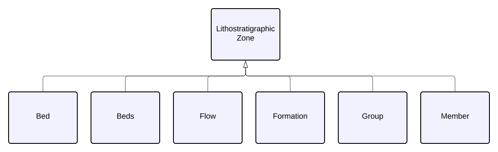
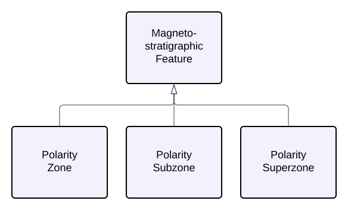

<a href="../../assets/features-hierarchy/Hierarchy.svg">
<figure id="figure-gfh" markdown style="width:70%">
  
  <figcaption>Figure GFH: A Feature class hierarchy within which this Model's elements exists</figcaption>
</figure>
</a>

<a href="../../assets/features-hierarchy/N Hierarchy.svg">
<figure id="figure-bh" markdown>
  
  <figcaption>Figure GFH2: This Model's class hierarchy</figcaption>
</figure>
</a>

### Biostratigraphic Features

<a href="../../assets/features-hierarchy/N Bio.svg">
<figure id="figure-bh" markdown>
  
  <figcaption>Figure GFBIO: This Model's Bio-stratigraphic class hierarchy</figcaption>
</figure>
</a>

### Lithostratigraphic Features

<a href="../../assets/features-hierarchy/N Litho.svg">
<figure id="figure-bh" markdown>
  
  <figcaption>Figure GFHLITHO: This Model's Litho-stratigraphic class hierarchy</figcaption>
</figure>
</a>

### Magnetostratigraphic Features

<a href="../../assets/features-hierarchy/N Magneto.svg">
<figure id="figure-bh" markdown style="width:50%">
  
  <figcaption>Figure GFHMAGNETO: This Model's Magneto-stratigraphic class hierarchy</figcaption>
</figure>
</a>