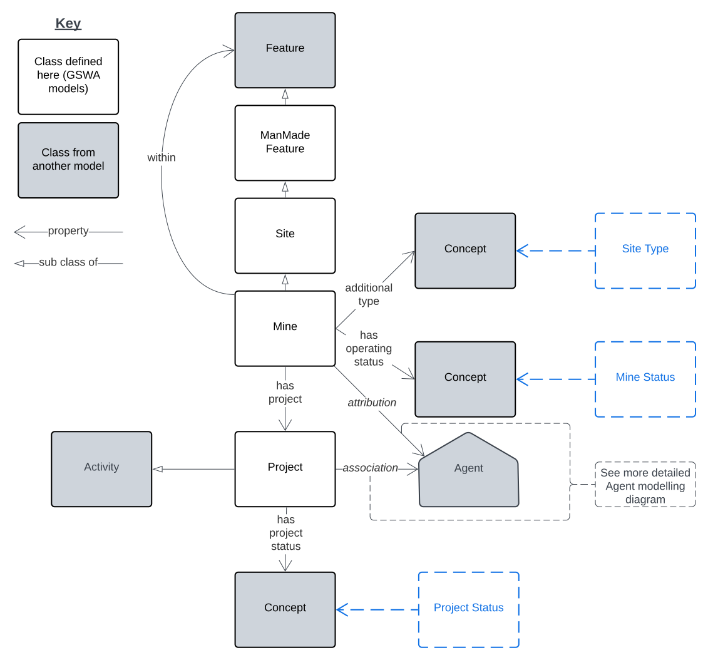
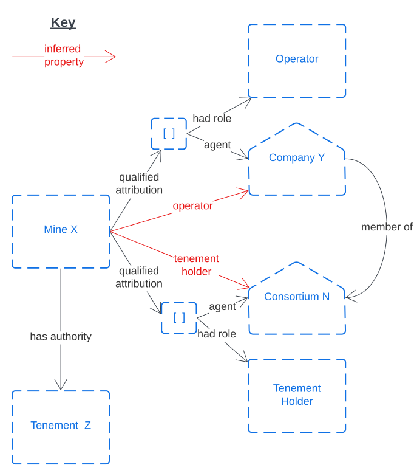

## Overview

<a href="../../assets/mines-Overview.svg">
<figure id="figure-bh" markdown style="width:100%">
  
  <figcaption>Figure MO: Overview of this Mines Model</figcaption>
</figure>
</a>

This Mines Model is a model of the physical and administrative characteristics of mines. It considers a mine to be both a geospatial object (a special type of man-made Feature) with spatial properties and relations and also a conceptual object with properties for operation such, as agents with roles like "Operator", the project that manages the mine and legislative or regulatory instrument relations, to things such as Permits.

## Modelling Principles

### Site & Mine Typing

A _Site Types_ vocabulary defines the various specialised types of Site, such as _Mine_, _Infrastructure_, _Processing Plant_ etc. and, within that, there is a hierarchy of types narrower than _Mine_. Object of the class Mine in this model may onl be further typed with narrower concepts of _Mine_. 

### Agent Relations

<a href="../../assets/mines-Agents.svg">
<figure id="figure-bh" markdown style="width:50%">
  
  <figcaption>Figure MAg: Mines Model Agent relations - general pattern</figcaption>
</figure>
</a>

Agents relations - of Mines and Mine Projects to People and Organisations - follows the standards [PROV](../background.md#prov) standard [_qualified relations pattern_](https://www.w3.org/TR/prov-o/#cross-reference-qualified-terms) so Agents with relations to Mines and Projects can be indicated with Roles. See Example 1 in [Example Scnearios](#example-scenarios) below.

### Authorities

<a href="../../assets/mines-Authorities.svg">
<figure id="figure-bh" markdown style="width:70%">
  
  <figcaption>Figure MA: Mines Authorities</figcaption>
</figure>
</a>

Authorities are licenses, permits etc. that give permission or exclusivity to own/operate Mines in designated areas.

Authority modelling itself is not directly handled in this model (see the [Authorities Component Model](../components/authorities.md) for that) however common authorities associated with Mines and Projects are shown here.

### Commodities

<a href="../../assets/mines-Commodities.svg">
<figure id="figure-bh" markdown style="width:60%">
  
  <figcaption>Figure MC: Mines Commodities</figcaption>
</figure>
</a>

Commodities are properties of interest within Mines and other Man-made as well as Natural Features. Commodities are not directly modelled here, only the association between a Mine and a Commodity. Commodities need to be listed within a vocabulary.

## Example Scenarios

### Example 1: A Mine with an Operator and Authority 

The following example uses both the un-qualified and qualified relations for a fictitious Mine & Tenement. The pattern will also work for Lease and other forns of Authority.

<a href="../../assets/mines-EX.1.svg">
<figure id="figure-bh" markdown style="width:50%">
  
  <figcaption>Figure EX.1: Mine X is operated by Company Y which is part of Consortium N that holds the Tenement Z</figcaption>
</figure>
</a>

## Example Data

Here is example RDF data for the union of the examples above:

```
PREFIX ex: <http://example.com/>
PREFIX gswa: <https://linked.data.gov.au/def/gswa-supermodel/>
PREFIX prov: <http://www.w3.org/ns/prov#>
PREFIX sdo: <https://schema.org/>

ex:mine-x
    a gswa:Mine ;
    prov:qualifiedAttribution
        [
            prov:agent ex:company-y ;
            prov:hadRole ex:Operator
        ] ,
        [
            prov:agent ex:consortium-n ;
            prov:hadRole ex:TenementHolder
        ] ;
    gswa:hasAuthority ex:tenement-z ;
    sdo:name "Mine X" ;
.

ex:company-y
    a sdo:Organization ;
    sdo:memberOf ex:consortium-n ;
    sdo:name "Company Y" ;
.

ex:tenement-z
    a gswa:Tenement ;
.

ex:consortium-n
    a sdo:Organization ;
    sdo:name "Consortium N" ;
.
```

## Vocabularies

Vocabularies supporting this model and the positions within the model they occupy are listed and described below.

**Vocabulary** | **Description** | **Model Position**
--- | --- | ---
Agent Roles<br /><br />_Not developed yet_ | The roles that Agents play with respect to Sites, Authorities & one another | Range value for `prov:hadRole` predicate used `prov:Attribution` instance
Site Types<br /><br />_Not developed yet_ | Fine-grained types of Site | Range value for `sdo:additionalType` predicate used on `Mine` (`Site`) instances
Site Operational Statuses<br /><br />_Not developed yet_ | The status of a Site's operations | Range value for `hasOperatingStatus` predicate used on `Mine` (`Site`) instances
Project Status<br /><br />_Not developed yet_ | The status of a Project | Range value for `hasProjectStatus` predicate used on `Project` instances
Commodities<br /><br />_Not developed yet, could derive from [CGI's Commodity Codes vocabulary](http://resource.geosciml.org/classifier/cgi/commodity-code)_ | Types of Commodity | Range value for `hasCommodity` predicate used on `Mine` (`Site`) instances