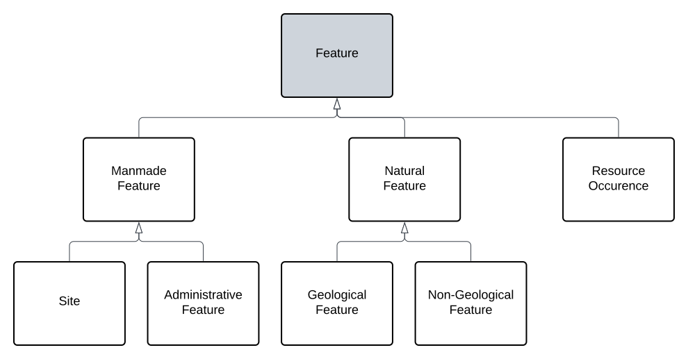
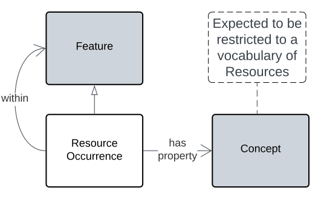
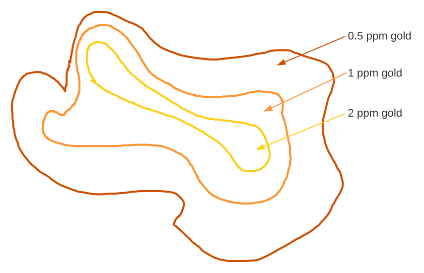

## Overview

Resource Occurrences are areas/volumes of the earth's crust that contain a resource of interest for exploitation. The general logic of an RO is that there is both an occurrence - presence or absence of something - that is interesting - perhaps in higher concentrations than elsewhere - and an exploitation potential. This model doesn't directly deal with exploitation potential and restricts its modelling to the _occurrence_ part only. 

Expected use of this model is to characterise the spatial presence of identified observable properties of parts of the earth's crust and then for external modelling to establish the exploitation potential.

The figure below places ROs within a Features class hierarchy.

<a href="../../assets/resource-occurrence/Key.svg">
<figure id="figure-bh" markdown style="width:20%">
  
  <figcaption>Figure ROK: Key for of this Model's element figures</figcaption>
</figure>
</a>

The Key for the figure above and other figures in this model is below.

<a href="../../assets/features-hierarchy/Hierarchy.svg">
<figure id="figure-gfh" markdown style="width:80%">
  
  <figcaption>Figure ROH: A Feature class hierarchy within which this Model's elements exists</figcaption>
</figure>
</a>

An RO is not necessarily a natural feature - it could be a tailings mound - so ROs are only modelled as subclasses of the generic geospatial `Feature` class, however, other classing may be applied as appropriate, thus an orebody will be both an RO and a `Natural Feature` or perhaps `Geological Feature`.

### Defining the resource

What is the RO an occurrence of? Likely some geological or natural property, such as a concentration of gold or reservoir of oil. Whatever it is, it is to be indicated by a link from the RO to the description of the property which should be recorded in a controlled vocabulary. This is indicated in the figure below. 

<a href="../../assets/resource-occurrence/Overview.svg">
<figure id="figure-bh" markdown style="width:50%">
  
  <figcaption>Figure ROO: Overview of this Model</figcaption>
</figure>
</a>

### Defining the extent

Where is the RO? Any geospatial modelling can be used to model where the RO is. For example:

* a Point location - likely useful for broad area maps
* a Polygon - for detailed maps
* a 3D Polygon - for calculating total mass of commodity
* a fuzzy polygon - for area estimates

All spatial modelling options listed above are standard options available for any Feature class instances in the GeoSPARQL model and RO is a subclass of Feature, so they are available for ROs too.

## Examples

A Resource Occurrence of gold indicated with a fuzzy polygon.

<a href="../../assets/resource-occurrence/Example.svg">
<figure id="figure-bh" markdown style="width:50%">
  
  <figcaption>Figure ROE: A Resource Occurrence of gold indicated with a fuzzy polygon</figcaption>
</figure>
</a>

```
PREFIX ego: <https://w3id.org/idn/def/ego/>
PREFIX ex: <http://example.com/>
PREFIX geo: <http://www.opengis.net/ont/geosparql#>
PREFIX qudt: <http://qudt.org/schema/qudt/>
PREFIX rdf: <http://www.w3.org/1999/02/22-rdf-syntax-ns#>
PREFIX rom: <https://linked.data.gov.au/def/resource-occurrence/>
PREFIX sosa: <http://www.w3.org/ns/sosa/>
PREFIX unit: <http://qudt.org/vocab/unit/>


ex:ro-x
    a rom:ResourceOccurrence ;
    geo:hasQualifiedGeometry [
        a ego:QualifiedGeometry ;
        geo:asWKT "POLYGON (( ... ))"^^geo:wktLiteral ;
        ego:evidence [
            a sosa:Observation ;
            sosa:hasResult [
                a sosa:Result ;
                rdf:value 2.0 ;
                qudt:unit unit:PPM ;
            ] ;
        ] ;
    ] ,
    [
        a ego:QualifiedGeometry ;
        geo:asWKT "POLYGON (( ... ))"^^geo:wktLiteral ;
        ego:evidence [
            a sosa:Observation ;
            sosa:hasResult [
                a sosa:Result ;
                rdf:value 1.0 ;
                qudt:unit unit:PPM ;
            ] ;
        ] ;        
    ] ,
    [
        a ego:QualifiedGeometry ;
        geo:asWKT "POLYGON (( ... ))"^^geo:wktLiteral ;  
        ego:evidence [
            a sosa:Observation ;
            sosa:hasResult [
                a sosa:Result ;
                rdf:value 0.5 ;
                qudt:unit unit:PPM ;
            ] ;
        ] ;           
    ] ;
.
```