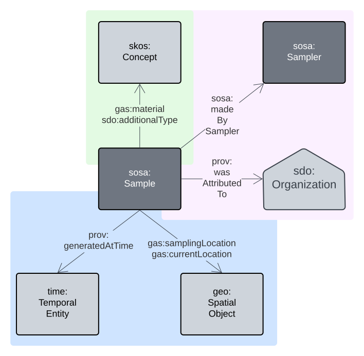
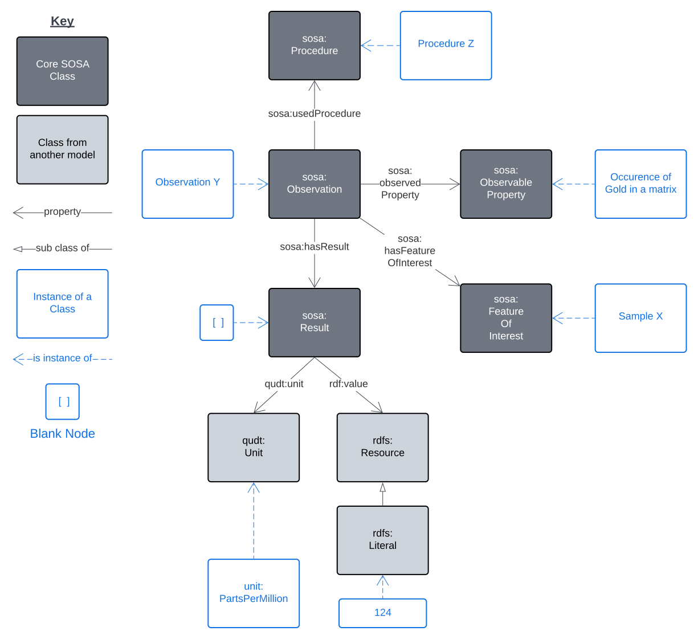
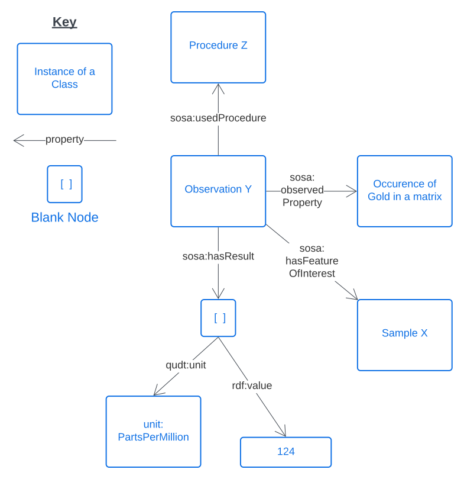

## Overview

<a href="../../assets/samples-Overview.svg">
<figure id="figure-bh" markdown style="width:100%">
  
  <figcaption>Figure SO: Overview of the SOSA-based Samples Model</figcaption>
</figure>
</a>

This Samples Model is an implementation of [SOSA](../background.md#sosa)'s _Sampling_ framing to link Samples to Observations and the things they are samples of (Features), with detailed Sample properties taken from a number of non-Semantic Web models such as [GeoSciML](../background.md#geosciml) and the [IGSN Description Model](#igsn-description-model). Specific connections to other models such as [DCAT](../background.md#dcat) are also included to allow for Samples model data cataloguing.

_**NOTE**: This model implements no new Classes or Properties of its own and thus is just a profile of other models. The Classes and Properties from other models suggested for use are shown in the Overview figure about and the sample details figures below. Note also that this model is a profile of this Supermodel's Backbone Model and thus is constrained to be valida according to that model._

## Sample Details

The model overview above shows the relation of Sample to other SOSA classes however the model subset below shows basic properties of just Sample.

<a href="../../assets/samples-SampleProps.svg">
<figure id="figure-bh" markdown style="width:70%">
  
  <figcaption>Figure SP: Sample properties</figcaption>
</figure>
</a>

The properties of the Sample class can be categorised in the following groups which are coloured in the figure below:

* Classification properties (green)
* Entity/Agent relations (mauve)
* Spatio-temporality (blue)

<a href="../../assets/samples-SamplePropsColoured.svg">
<figure id="figure-bh" markdown style="width:70%">
  
  <figcaption>Figure SP: Sample properties, categorised</figcaption>
</figure>
</a>

The values for the classification properties MUST all come from controlled vocabularies of terms. The following section contains more information about the vocabularies required for use here.

Entity/Agent relations are indicated using [PROV](../background.md#prov) thus if specialised roles need to be allocated to particular Agents related to a Sample, perhaps such as 'Curator' and 'Collector', the [qualified relations](https://patterns.dataincubator.org/book/qualified-relation.html) pattern and a vocabulary of roles can be used with `prov:qualifiedAttribution` as per the figure below:

<a href="../../assets/samples-SampleAttribution.svg">
<figure id="figure-bh" markdown style="width:70%">
  
  <figcaption>Figure SP: Sample attribution: qualified and un-qualified forms</figcaption>
</figure>
</a>

## Example Scenarios

### Geochemistry observations

A physical rock, sediment or soil sample, "Sample X", may be taken in the field and analysed in a laboratory to determine the occurrence of gold which is found to be 124 parts per million. The act of analysis is termed an Observation - "Observation Y" - and in this case it followed the method "Procedure Z". The result and the unit of measure used are bundled into a result which is given no independent identity (a Blank Node):

<a href="../../assets/samples-EX1.a.svg">
<figure id="figure-bh" markdown style="width:70%">
  
  <figcaption>Figure SX1a: Example sampling scenario showing classes and class instances</figcaption>
</figure>
</a>

Removing all the class information to just show object relations directly:

<a href="../../assets/samples-EX1.b.svg">
<figure id="figure-bh" markdown style="width:50%">
  
  <figcaption>Figure SX1b: Example sampling scenario showing class instances only</figcaption>
</figure>
</a>

### Linking Sampling results to Features

For the example above, if "Sample X" was actually part of a larger sample, "Sample N", which was taken from a drillhole was drilled into "Rock Unit O" then we have:

<a href="../../assets/samples-EX2.svg">
<figure id="figure-bh" markdown style="width:60%">
  
  <figcaption>Figure SX2: Example linking Sampling to Features</figcaption>
</figure>
</a>

In this scenario, we can infer (calculate) that "Rock Unit O" has the geological property of "Occurrence of Gold in a Matrix" and thus it contains gold at some overall concentration that the sample is approximating.

### Packaging Observations in Catalogues

An Observation Collection is a grouping of Observations and, in this scenario, a grouping has a single supplier/creator, "Company Q". 

<a href="../../assets/samples-EX3.svg">
<figure id="figure-bh" markdown style="width:100%">
  
  <figcaption>Figure SX2: Example showing cataloguing of Observations</figcaption>
</figure>
</a>

To catalogue this Observation Collection, we treat it as a Dataset and make an Excel Spreadsheet version of it available as a Distribution.

Since the Sample is ultimately of "Rock Unit O", we can infer that the Dataset has the location of, or at least includes the location of, "Rock Unit O", hence the `dcterms:spatial` inferred property.

We can also infer that the Dataset has the theme (`dcterms:theme`) of the particular property that was observed: "Occurrence of Gold in a Matrix".

This modelling will allow users of a catalogue to discover this Observation Collection by either searching for things in the area of "Rock Unit O" or that deal with the occurrence of gold.

### Sample properties

For the Sample used in the previous scenarios, "Sample X" could be a rock sample, on a shelf in the rock shet, sampled by John Smith at some location and, we could have the following properties for it:

<a href="../../assets/samples-EX4.svg">
<figure id="figure-bh" markdown style="width:100%">
  
  <figcaption>Figure SX2: Example Sample properties</figcaption>
</figure>
</a>


## Example Data

Here is example RDF data for the union of the examples above:

```
PREFIX dcat: <http://www.w3.org/ns/dcat#>
PREFIX dcterms: <http://purl.org/dc/terms/>
PREFIX ex: <http://example.com/>
PREFIX gas: <https://linked.data.gov.au/def/gas/>
PREFIX geo: <http://www.opengis.net/ont/geosparql#>
PREFIX gswa: <https://linked.data.gov.au/def/gswa-supermodel/>
PREFIX prov: <http://www.w3.org/ns/prov#>
PREFIX qudt: <http://qudt.org/schema/qudt/>
PREFIX rdf: <http://www.w3.org/1999/02/22-rdf-syntax-ns#>
PREFIX rdfs: <http://www.w3.org/2000/01/rdf-schema#>
PREFIX sdo: <https://schema.org/>
PREFIX skos: <http://www.w3.org/2004/02/skos/core#>
PREFIX sosa: <http://www.w3.org/ns/sosa/>
PREFIX time: <http://www.w3.org/2006/time#>
PREFIX unit: <http://qudt.org/vocab/unit/>
PREFIX xsd: <http://www.w3.org/2001/XMLSchema#>

ex:observation-y
    a sosa:Observation ;
    sosa:hasFeatureOfInterest ex:sample-x ;
    sosa:userProcedure ex:procedure-z ;
    sosa:observedProperty ex:occurence-of-gold-in-a-matrix ;
    sosa:hasResult [
        a sosa:Result ;
        qudt:unit unit:PPM ;
        rdf:value "124.0"^^xsd:float ;
    ] ;
.

ex:sample-x
    a sosa:Sample ;
    sosa:isSampleOf ex:sample-n ;
    gas:material ex:Rock ;
    gas:samplingMethod ex:CoreDrill ;
    sdo:additionalType ex:CoreSectionHalf ;
    prov:qualifiedAttribution [
        prov:agent [
            a sdo:Person ;
            sdo:name "John Smith" ;
        ] ;
        prov:hadRole ex:Collector ;
    ] ;
    prov:generatedAtTime [
        a time:Instant ;
        time:inXSDDate "2023-06-09"^^xsd:date ;
    ] ;
    gas:samplingLocation [
        a geo:Geometry ;
        geo:asWKT "POINT (...)"^^geo:wktLiteral ;
    ] ;
    gas:currentLocation [
        a geo:Feature ;
        dcterms:description "Rock Shed, Shelf 12, Box 32" ;
    ] ;
.

ex:sample-n
    a sosa:Sample ;
    sosa:isSampleOf ex:sample-n ;
.

ex:rock-unit-o
    a gswa:GeologicalFeature ;
    sosa:hasProperty ex:occurence-of-gold-in-a-matrix ;
.

ex:procedure-z
    a sosa:Procedure ;
.

unit:PPM
    a qudt:Unit ;
.

ex:occurence-of-gold-in-a-matrix
    a skos:Concept ;
.

ex:observation-collection-p
    a sosa:ObservationCollection , dcat:Dataset ;
    prov:wasAttributedTo ex:company-q ;
    dcterms:spatial ex:rock-unit-o ;
    dcat:theme ex:occurence-of-gold-in-a-matrix ;
    dcat:distribution [
        a dcat:Distribution ;
        dcterms:format "application/vnd.ms-excel" ;
        dcat:downloadURL "http://somewhere.com/blob/1"^^xsd:anyURI ;
    ] ;
    rdfs:member ex:observation-y ;
.

ex:company-q 
    a sdo:Organization ;
.
```

## Vocabularies

Vocabularies supporting this model and the positions within the model they occupy are listed and described below.

**Vocabulary** | **Description** | **Model Position**
--- | --- | ---
[GSWA Sample Materials](https://linked.data.gov.au/def/gswa-sample-materials)<br /><br />Derived from [GA's Material Type](http://pid.geoscience.gov.au/def/voc/ga/materialtype) vocabulary | Types of material which samples may consist of | Range value for `gas:material` predicate used on a `Sample` instance
[GSWA Specimen Types](https://linked.data.gov.au/def/gswa-specimen-types)<br /><br />Derived from [ODM's Specimen Type](http://vocabulary.odm2.org/specimentype) vocabulary | Types of physical Specimen | Range value for `sdo:additionalType` predicate used on a `Sample` instance
[GSWA Sampling Methods](https://linked.data.gov.au/def/gswa-sampling-methods)<br /><br />Derived from [GA's Sampling Method](http://pid.geoscience.gov.au/def/voc/ga/samplingmethod) vocabulary | Methods used to collect geological samples | Range value for `gas:samplingMethod` predicate used on a `Sample` instance

## Mappings

Mappings from this model to other initiatives are described below. 

### IGSN Description Model

<http://schema.igsn.org/description/>

_Coming_

### GeoSciML - GeologicSpecimenView

<https://docs.ogc.org/is/16-008/16-008r1.html#443>

_Coming_
