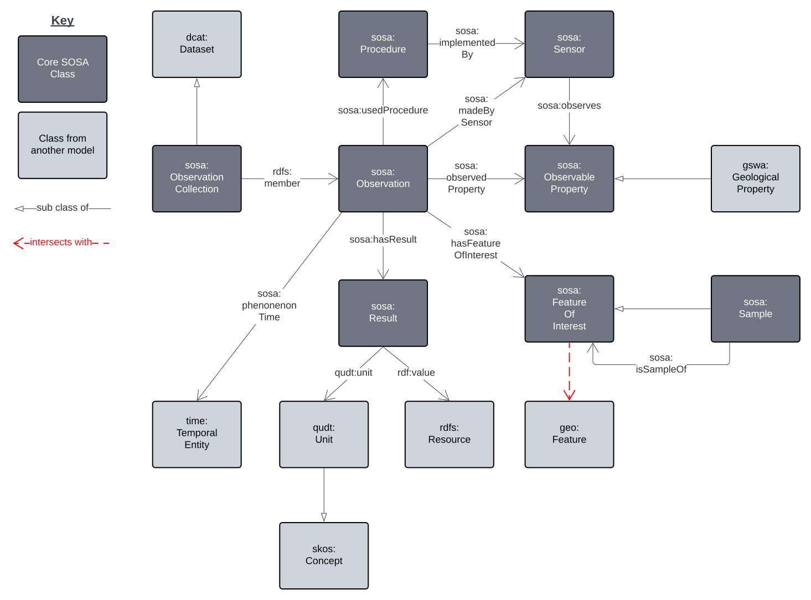
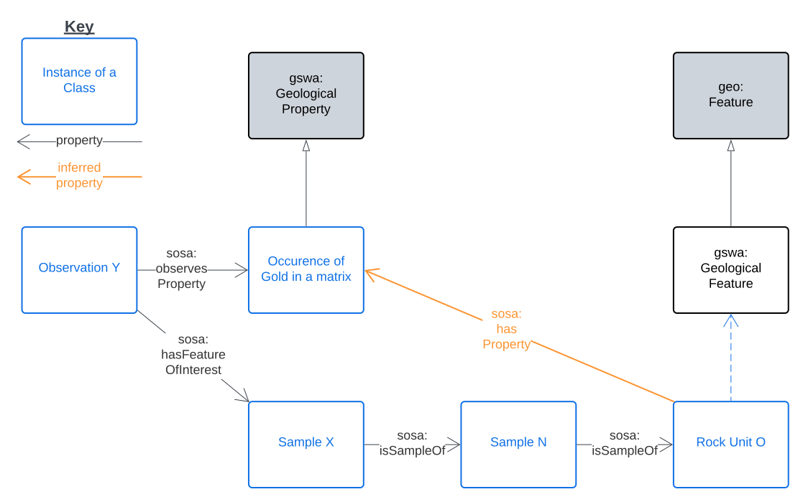
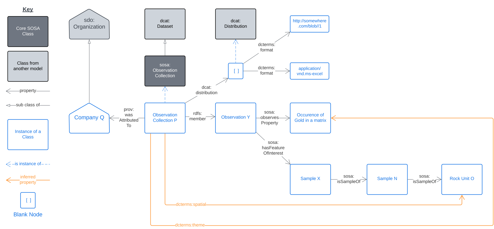

<a href="../../assets/samples-overview.svg">
<figure id="figure-bh" markdown style="width:100%">
  
  <figcaption>Figure SO: Overview of the SOSA-based Samples Model</figcaption>
</figure>
</a>

This Samples Model is an implementation of [SOSA](../background.md#sosa) with specific connections to other models such as [DCAT](../background.md#dcat) indicated by lining classes.

General use of this model should follow use of SOSA, however, here are a few dummy usage scenarios to demonstrate particular use.

## Example Scenarios

### Geochemistry observations

A physical rock, sediment or soil sample, "Sample X", may be taken in the field and analysed in a laboratory to determine the occurrence of gold which is found to be 124 parts per million. The act of analysis is termed an Observation - "Observation Y" - and in this case it followed the method "Procedure Z". The result and the unit of measure used are bundled into a result which is given no independent identity (a Blank Node):

<a href="../../assets/samples-ex1.a.svg">
<figure id="figure-bh" markdown style="width:70%">
  
  <figcaption>Figure SX1a: Example sampling scenario showing classes and class instances</figcaption>
</figure>
</a>

Removing all the class information to just show object relations directly:

<a href="../../assets/samples-ex1.b.svg">
<figure id="figure-bh" markdown style="width:50%">
  
  <figcaption>Figure SX1b: Example sampling scenario showing class instances only</figcaption>
</figure>
</a>

### Linking Sampling results to Features

For the example above, if "Sample X" was actually part of a larger sample, "Sample N", which was taken from a drillhole was drilled into "Rock Unit O" then we have:

<a href="../../assets/samples-ex2.svg">
<figure id="figure-bh" markdown style="width:60%">
  
  <figcaption>Figure SX2: Example linking Sampling to Features</figcaption>
</figure>
</a>

In this scenario, we can infer (calculate) that "Rock Unit O" has the geological property of "Occurrence of Gold in a Matrix" and thus it contains gold at some overall concentration that the sample is approximating.

### Packaging Observations in Catalogues

An Observation Collection is a grouping of Observations and, in this scenario, a grouping has a single supplier/creator, "Company Q". 

<a href="../../assets/samples-ex3.svg">
<figure id="figure-bh" markdown style="width:100%">
  
  <figcaption>Figure SX2: Example showing cataloguing of Observations</figcaption>
</figure>
</a>

To catalogue this Observation Collection, we treat it as a Dataset and make an Excel Spreadsheet version of it available as a Distribution.

Since the Sample is ultimately of "Rock Unit O", we can infer that the Dataset has the location of, or at least includes the location of, "Rock Unit O", hence the `dcterms:spatial` inferred property.

We can also infer that the Dataset has the theme (`dcterms:theme`) of the particular property that was observed: "Occurrence of Gold in a Matrix".

This modelling will allow users of a catalogue to discover this Observation Collection by either searching for things in the area of "Rock Unit O" or that deal with the occurrence of gold.

## Example Data

Here is example RDF data for the union of the examples above:

```
ex:observation-y
    a sosa:Observation ;
    sosa:hasFeatureOfInterest ex:sample-x ;
    sosa:userProcedure ex:procedure-z ;
    sosa:observedProperty ex:occurence-of-gold-in-a-matrix ;
    sosa:hasResult [
        a sosa:Result ;
        qudt:unit unit:PPM ;
        rdf:value "124.0"^^xsd:float ;
    ] ;
.

ex:sample-x
    a sosa:Sample ;
    sosa:isSampleOf ex:sample-n ;
.

ex:sample-n
    a sosa:Sample ;
    sosa:isSampleOf ex:sample-n ;
.

ex:rock-unit-o
    a gswa:GeologicalFeature ;
    sosa:hasProperty ex:occurence-of-gold-in-a-matrix ;
.

ex:procedure-z
    a sosa:Procedure ;
.

unit:PPM
    a qudt:Unit ;
.

ex:occurence-of-gold-in-a-matrix
    a skos:Concept ;
.

ex:observation-collection-p
    a sosa:ObservationCollection , dcat:Dataset ;
    prov:wasAttributedTo ex:company-q ;
    dcterms:spatial ex:rock-unit-o ;
    dcat:theme ex:occurence-of-gold-in-a-matrix ;
    dcat:distribution [
        a dcat:Distribution ;
        dcterms:format "application/vnd.ms-excel" ;
        dcat:downloadURL "http://somewhere.com/blob/1"^^xsd:anyURI ;
    ] ;
    rdfs:member ex:observation-y ;
.

ex:company-q 
    sdo:Organization ;
.
```