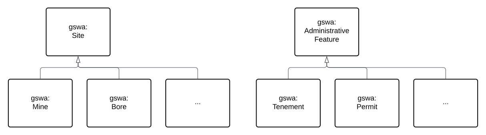

# Sites & Admin Features Profile

<a href="../../assets/features-hierarchy.svg">
<figure id="figure-bh" markdown style="width:50%">
  
  <figcaption>Figure SAH: A Feature class hierarchy within which this Model's elements exists</figcaption>
</figure>
</a>

<a href="../../assets/sites-admin-hierarchy.svg">
<figure id="figure-bh" markdown>
  
  <figcaption>Figure SAH2: This Model's class hierarchy</figcaption>
</figure>
</a>
