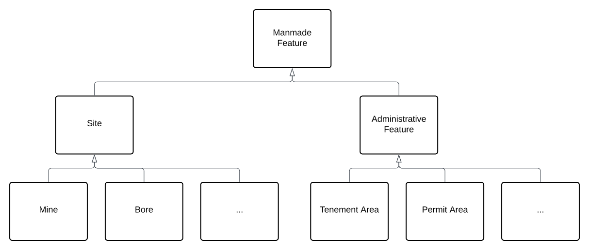

<a href="../../assets/features-hierarchy/Hierarchy.svg">
<figure id="figure-gfh" markdown style="width:70%">
  
  <figcaption>Figure GFH: A Feature class hierarchy within which this Model's elements exists</figcaption>
</figure>
</a>

<a href="../../assets/features-hierarchy/MM Hierarchy.svg">
<figure id="figure-bh" markdown>
  
  <figcaption>Figure SAH2: This Model's class hierarchy</figcaption>
</figure>
</a>
