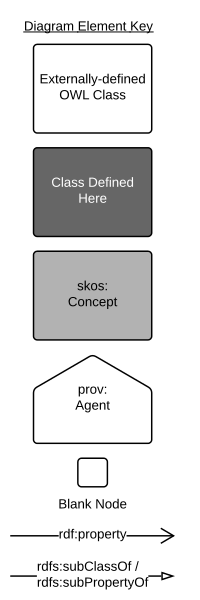

# The Supermodel

<figure markdown>
    
  <figcaption>Figure O: Informal overview of this Supermodel and its various parts.</figcaption>
</figure>

## Introduction

This "Supermodel" is a multi-part model that is used to coordinate expressions of data from multiple systems within the Geological Survey of WA (GSWA). Specifically, this model allows for:

* integration of data across systems
* for multi-system data holding analytics
* for system rationalisation planning
* delivery of coordinated data
* taking data from multiple, internal, data sources and delivering it for public or analytics use, in a coordinated manner

The major parts of this Supermodel are shown in [Figure 0](#the-supermodel) above.

Only a few of the total Vocabularies and Component Models of this Supermodel have so far been defined: see the status in [Overview/Status](index.md#status).

### Related Supermodels

This Supermodel relates to several other Supermodels in existence. The table below gives some details.

Supermodel | Relationship
--- | ---
[Foundational Spatial Data Framework Supermodel](https://linked.data.gov.au/def/fsdf-supermodel) | The FSDF Supermodel was created by [Geoscience Australia](https://www.ga.gov.au) to integrate multiple foundational spatial datasets within Australia. It specifies both a structure for spatial data and particular fundamental objects to join datasets with, such as authoritative boundaries for Australia and the states.  This supermodel adopts the FSDF Supermodel ways of working for spatial data
Geological Survey of Queensland's Supermodel (_not online yet_) | A Supermodel for a similar agency to GSWA. It implements many of the same Background Models, Vocabularies and some of the same Component Models, such as [Boreholes](components.md#boreholes-profile)

## Supermodel Structure

The structure of this Supermodel follows the conventions of the _Supermodel Model_ defined at:

* <https://linked.data.gov.au/def/supermodel>

Each of the main parts of this Supermodel is listed on the left.

Individual data models - called _Component Models_ here - are given within the [Component Models Section](components.md).

## Modelling Conventions

All of the models within this Supermodel are visualised with informal OWL diagrams. These are diagrams that represent the Classes, Properties and Axioms of the [Web Ontology Language](background.md#web-ontology-language-owl) with the elements shown in Figure K below.

<figure markdown>
  
  <figcaption>Figure K: OWL Diagram Element Key</figcaption>
</figure>

## Technical Assets

Many parts of this Supermodel, for example individual Component Models, are presented here in human-readable form (documentation) and also presented in machine-readable form for data validation and schema implementation. 

Machine-readable assets are presented as _Resources_ per model. For example, the schema for the [Boreholes Profile](components/boreholes.md) model is given in the [Boreholes Profile Schema](components/boreholes.md#schema) section and its validators in the [Boreholes Profile Validators](components/boreholes.md#validators) section.